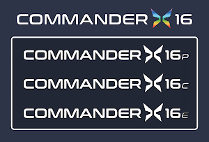

## What is the Commander X16?

Welcome! 

The Commander X16 is The 8-Bit Guy’s dream computer, designed to evoke the same fondness and nostalgia many of us had for 8-Bit computers, while retaining closeness to the hardware from a programming perspective, unlike the Raspberry Pi and others. But more than that, it is intended not only as an educational tool but to solve some of the issues of finding an 8-Bit system to tinker with today; namely ever-increasing costs, auction site price gouging/sniping, lack of replacement parts, and unreliability of 30-year old hardware.

The X16 will be made entirely with parts that are still readily available today, ensuring perpetual availability without reliability issues, but in keeping with David's vision, it will house a real CPU rather than using emulation or an FPGA recreation of a processor. Running Commodore BASIC V2 (with some additions), the X16 will be inexpensive enough to allow a critical mass of users to create an expansive software ecosystem, but simple enough that a single person can understand all of the chips and components that allow that software to run.

Three versions of the computer are planned under the "Commander X16" brand umbrella: 

* **Pro**: similar to a PC motherboard, this will fit in an ATX computer case
* **Console**: This is unapogetically a game console. It will feature cartridge support and a stylish
casing that calls back to the fun and functional designs of 80s game consoles. 
* **Educator**: (Elite? Economy? Take your pick.) Focused on size and price, this will be targeted at classrooms and STEM education.

## Who is The 8-Bit Guy

David Murray, AKA "The 8-Bit Guy" runs a successful YouTube channel centered on vintage computing. He also dabbles in music, electric car culture, off-grid energy production, computer refurbishment and resale. 

His web site is [https://www.the8bitguy.com/](https://www.the8bitguy.com/)

## Specifications
Commander X16P Features & Specifications (subject to change)

* CPU
  * WDC 65C02S @ 8 MHz
  * 40-pin DIP package
  * Protoype board currently running stable at 8 MHz
* RAM
  * 40K of "Low RAM":
    * As 39.75K + 256 bytes of IO space
    * 8 IO spaces of 32 bytes each; one for the VERA, one for the VIAs, one for the audio
  * 512K of "High RAM" standard:
    * As 64 banks of 8K
  * Expandable to 1 MB, 1.5 MB, or 2 MB by adding additional RAM chips to 3 empty sockets
    * Up to 256 banks of 8K
  * ROM
    * 512K of Flash ROM
      * As 32 banks of 16K
      * Expandable to 4MB of ROM or RAM with expansion cards. 
  * Standard Commodore Kernal
  * CMDR-BASIC
    * Microsoft BASIC 2.0 (Complete, identical to Commodore 64 and VIC-20)
	* Commander X16 extentions
  * Machine Language Monitor (Supermon and CODEX)
  * ROM can be flashed in place. 
* Expansion
  * Four expansion slots with access to CPU databus
  * Each slot can select from one or more of 5 addressable 32 bytes of IO space
  * User Port (Extra lines from the single VIA)
* Input Devices
  * PS/2 Keyboard
  * PS/2 Mouse
  * Two SNES style game ports (two more as pin headers)
* Storage
  * IEC compatible (Commodore) disk drive port
  * Internal SD card slot on VERA
* Audio
  * Yamaha YM2151 sound chip
  * PCM audio on VERA
  * PSG waveform generator on VERA (simple waveforms and frequency. No envelopes or effects.)
* "VERA" module specifications
  * Video generator featuring:
    * Multiple output formats (VGA, NTSC Composite, NTSC S-Video, RGB video) at a fixed resolution of 640x480@60Hz
    * Support for 2 layers, both supporting:
    * 1/2/4/8 bpp tile and bitmap modes
    * Support for up to 128 sprites (with inter-sprite collision detection).
  * Embedded video RAM of 128 KB.
  * Palette with 256 colors selected from a total range of 4096 colors.
  * 16-channel stereo Programmable Sound Generator with multiple waveforms (Pulse, Sawtooth, Triangle, Noise)
  * High quality PCM audio playback from an 4 KB FIFO buffer featuring up to 48kHz 16-bit stereo sound.
  * SecureDigital storage.
* Board power consumption: ~15W
* PSU: TBC

## When will the X16 be released?

The first batch of dev boards have been received by David. The team is currently hand soldering development boards, and they are working on a solder dip station for rapid assembly. The first 100 boards should be delivered this year, with additional sales to follow. 

## How much will it cost?

Pricing has not been announced yet. Expect roughly $400 for the Pro system. We hope to release the Consoles system at a
reduced proce and the Educator system for less than $100. 

## Why Commodore BASIC?

This entire computer is meant to be a close relative of the Commodore systems. While technically Commodore BASIC is actually Microsoft BASIC, David wants it to be as similar as possible to programming on a VIC-20, C64, or Plus/4. It will run BASIC v2 with some additions. We have reached agreement with the rights holder to license it for this purpose.

XXX

What about other languages?
There’s no reason you couldn’t program in C++ or whatever on this computer if somebody wants to port over a compiler. Alternatively, you can use a cross-compiler like cc65.
Will it be compatible with Commodore 64 software?
Although it runs Commodore BASIC (itself based on Microsoft BASIC as many machines were) it was never intended to be an "emulator" or compatible with the C64 or any other machine. It is its own machine, just as the ZX Spectrum, Atari 800, etc. were also distinct from the C64. There are also already several existing options for users looking for a C64 compatible machine with no need to add to that growing/crowded market. While it might be nice, it would make this project considerably more complicated, expensive, and most likely it would never get finished. Ultimately C64 compatibility is not the aim of this product. However, most C64 and other 8-Bit games should be easy to port to the X16 ecosystem if desired.
Why the name "X16"?
"Commander 16" would be abbreviated to "C16" and too easily confused with the Commodore "C16", so when Perifractic proposed the always cool "X" be added to make "X16" it got the team's vote. As for "16" the original design was to use an 816 processor, however the machine still has a 16-bit address space. But above all, the X16 is an 8-bit machine with 16-bit tendencies. Commander X16!

Why VGA instead of Composite or HDMI?
VGA is fairly easy to implement as compared to HDMI. And worst case, there are low-cost chips that can convert VGA to HDMI. And if you have to convert to HDMI, far better to convert from VGA than from composite.
What sort of expansions would be possible?
There will be up to 4 expansion slots that could be used for just about anything. One drawback of running at 8 MHz will be that many chips like SID chips will not run that fast, so additional logic would have to be implemented on the card in order to communicate with the chip.
What sort of joysticks will you use and why?
SNES style game controllers. There are a few reasons for this:
The controllers, or at least clones are still manufactured.
They offer more buttons, allowing more complex games for the X16 than the Atari 9-pin standard which only supports one fire button.
They require fewer I/O lines to operate them.
Joysticks have sort of fallen out of favor and most people these days prefer gamepad style controllers.
Will a floppy or CD-ROM drive be included?
Whilst they are not included, Phase 1 at the least does include an IEC compatible Commodore-style floppy disk drive port for those who wish to use it. A drive is not included as both technologies are largely obsolete. The X16 will use standard SD Cards, with a slot located at the back of the machine (because most people when polled stated they rarely switch out the card once inserted.) Part of David's vision is that the X16 is made with still-available parts, and this extends to the storage media availability. Floppy disks are rarely if at all made any more. We do understand the nostalgic importance of those media, however they can still be enjoyed with 80s hardware or our IEC port.

What do you need help with the most?
At the moment we need software development. The emulator is now available and people can start writing their own code. You can upload your creations to the software library at this website.
Will it be available as a kit/pre-assembled/motherboard only?
We haven't decided for certain. The problem with selling it as a kit is that the design team will not have time for being end-user tech support. So, while the kit may end up being cheaper, it will also be sold without official technical support - although this website has been set up so people can still obtain support from the community and/or developers. If people assemble it and it doesn’t work, they can ask for support there. We will update the FAQ once a decision has been reached about whether to provide a kit option. As for a motherboard only option, our focus now is on releasing the computer. Once the project is launched and established, we will revisit these kind of options.
Will a keyboard be included?
Perifractic (who also designed this website) designed a bespoke PETSCII mini keyboard that will be included with all X16 orders. The prototype is now in hand and the deposit for the first 1000 units has been paid.
By popular demand from keyboard connoisseurs there is also a premium microswitch keyboard option available from WASD available now and compatible with the emulator and X16 itself.
Why PS/2 Keyboard and not USB?
USB is tremendously more difficult to implement than PS/2. A good analogy is like the difference between implementing RS-232 or Ethernet. PS/2 keyboards (and mice) are still manufactured, easy to find, and inexpensive. And, since the kernel is going to handle keyboard input, there’s no reason we can’t upgrade to USB later when we have the resources for that - and it shouldn’t break compatibility.
Will a case be included?
Updated answer here written by Perifractic: 
Why is the keyboard separate not integrated into a case like a C64?
There are a few reasons:

The Phase 1 motherboard is likely too large to fit inside a keyboard-case, and doing so would also rule out having full height internal expansion cards like an Apple 2.

We have heard comments like "retro computers are all-in-one with integrated keyboard!"... then again there was the Amiga 1000, A2000, A2500, A3000, A4000, Apple Macintosh, Apple III, Apple IIGS, Commodore 128D, Amstrad PCW, Amstrad PC1512, Amstrad PC1640, Acorn Archimedes, Sony MSX, Atari Mega ST, Atari TT030, Coleco Adam, & many more beautiful retro machines with separate keyboards.
We and many users believe that the flexibility of being able to position the main computer away from the keyboard on your desk, without multiple wires trailing across the desk between, is actually a functional bonus and why Apple went this route with the Macintosh, with the others following suit.
We also aren't going with 3D printing due to speed, cost, & quality concerns. The technology just isn’t ready yet.
What about expansion cards for each phase?
Phase 1: 4 expansion card slots
Phase 2: Undecided but there may be 1 or more slots inside that can use a 90-degree riser to still allow a card to be inserted in the lower case. Another option may be an external expansion card slot that can take a 4-in-1 adapter (similar to those C64 cartridge port expanders).
Phase 3: No expansion slots but expansion options are yet to be determined.
Why isn't a monitor included?
Many enthusiasts already have a compatible monitor (see specs at top) however they do not already have an X16! The goal is to deliver the most affordable package to get people up and running. Plenty of third party options are available. We have not ruled out providing a monitor in the future.
How about a mouse?
Whilst there is a dedicated PS/2 mouse port at the back, we haven't decided if a mouse will be included as standard. It would increase the cost and some users may not need one. It may be an option at the store.
Will it be available in the USA, Europe, & beyond?
We hope to offer international shipping from the USA.
Will user guides be included?
Perifractic designed a nostalgic traditional spiral bound Getting Started guide with an awesome (top secret) cover co-created by him and Trevor Storey. The manual includes a BASIC programming guide. The rest of the team are currently finishing up the finer details of the manual. Further docs are already available in the Downloads section of this website. The working title for the spiral bound guide is “Just the BASICs: Getting started with the Commander X16”. There will also be “Assembling Assembly” and a programmer’s reference guide. PDFs will likely be an option.
Why not use the Parallax Propeller chip?
We will not be using the Propeller for these reasons:
Most of its capabilities are on par with or inferior to our custom FPGA.
There are issues when putting it on the system bus related to CPU read attempt speed call and answer
The Propeller costs the same as if not more than the faster FPGA
Will there be a GUI?
We are exploring this option. An ideal GUI might use a text character set, rather than graphics - see http://www.c64os.com/c64os as a reference. The emulator also already incorporates GEOS. Type "GEOS" to get started, although it is still in beta and you will need a GEOS disk image file to get started.
Is there an emulator?
Yes, you can download it from via the Downloads section of this site or try the web-based emulator from the home page!
Is there a software library webpage?
Yes, just click Downloads above to get started!
What is the correct short-name for the Commander X16?
We just call it the "X16".
Will the X16 become open source?
At some point, most likely yes. However we have to consider that part of the code that makes the whole system work is owned by other rights holders who inherited it from Commodore/Microsoft and whom we have licensed it from (only some parts of the emulator are covered by the BSD-2 Clause License, not all parts). Before making the entire X16 open source or allowing custom machine builds based around our code, we will need to get the necessary additional permissions or work out a way that is acceptable to all parties. This will happen some time after the machine's physical releases. Until then, we cannot encourage clone machines based on the X16 code as it may jeopardize the license relationships we worked hard to forge. Thanks for your understanding.
Will there be a beta programme?
Currently the plan is to beta test among a pre-selected core group. In order to reduce the number of emails/messages the team receives from people asking to be part of this - which we understand and appreciate - it is important to state that the beta will initially be closed/invite only. It is expected that almost all testers selected will be the most active developers in the X16 community/software library up until now, and hardware specialists who have assisted with the project thus far. If there is a later beta that is more open it will be announced at such time. Please kindly do not request updates or to put your name forward. Thank you.
Is this a commercial or not-for-profit venture?
The Commander X16 has been developed by a team of enthusiasts who shared David's vision to create a reliable, low cost, modern retro computer for the benefit of the retro community. The team is committed to launching the Commander X16 at the lowest price possible while still ensuring that the team will be reimbursed for out of pocket expenses incurred during the 2+ year development process (such as parts, prototypes, shipping, web hosting, etc.) David and the team are not looking to profit from the project and instead seek to strike a balance between continuing to produce the Commander X16 at an affordable price while also meeting the ongoing costs associated with continued development, manufacture, and infrastructure (e.g., website hosting, legal assistance, prototyping, deposits on parts, and so on).

Who's been bringing the project to life?
The team has included at various points:
David Murray aka The 8-Bit Guy - Ringleader and software development
Kevin Williams aka TexElec - Board design/Prototyping/Manufacturing
Christian Simpson aka Perifractic - Visual design, Branding, Website creation
Michael Steil - ROM (KERNAL, BASIC) and Emulator
Frank van den Hoef - VERA Video chip design
Michael Allison - Assembler environment