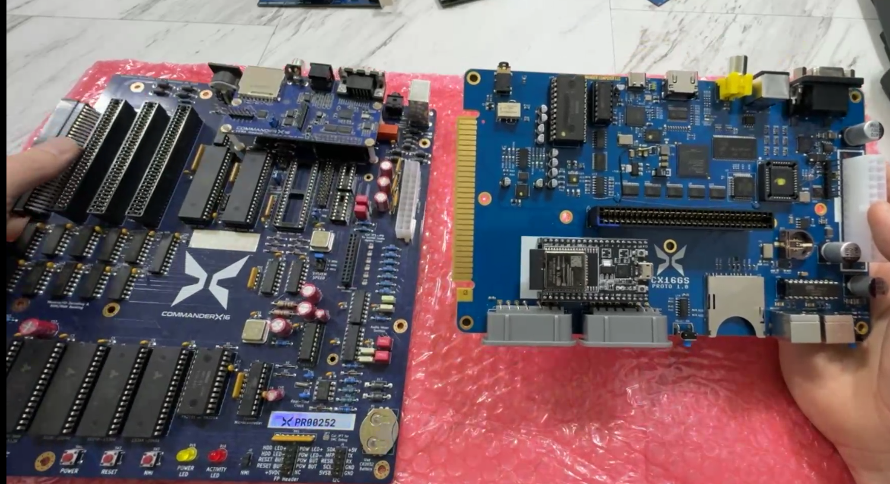
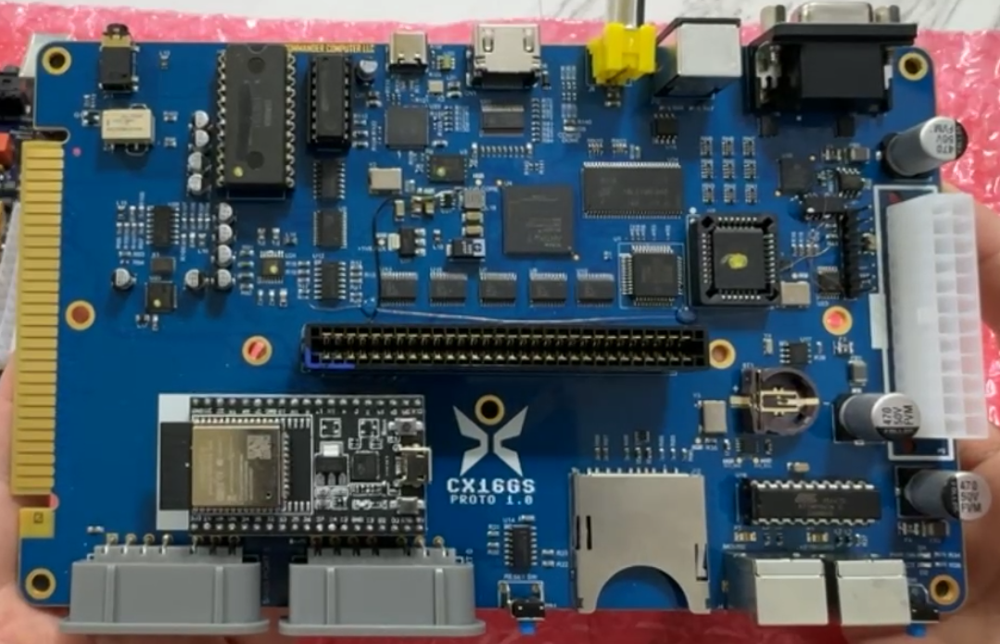

# Commander X16GS FAQ

On March 16, 2025, David Murry, aka The 8-Bit Guy, hosted a Live Stream on
Facebook. In it, he showed the current CX16GS prototype, which is very
different, but still compatible, with the baseline Commander X16.

## What is the Commander X16GS (aka Gen-2)?

The CX16GS is the second version of the Commander X16 motherboard. This is
designed to be more of a console type layout, and it will fit a dedicated
console style case. 

This is a phyiscally smaller board that leverages surface-mount technology and
FPGA, and there are a few functional differences from the Dev board.

New Features and upgrades:

* CPU upgraded to WDC 65C816.
  * 65C02 specific opcodes will be lost
  * 65C816 specifc features will be available: 24-bit addressing and new
    opcodes.
* 32MB of DRAM
    * 2MB at $00/$A000 banks will still be available
    * 16MB will be availble when in 16-bit mode
    * Some sort of ROM mapping will also be possible. (See Kevin's notes below.)
    * BASIC RAM likely still limited to 37KB, with I/O at $9F00-$9FFF
* CPU Speed upgrade: CPU speed will be software adjustable. 12MHz is the current
  number being proposed.
* The motherboard is NOT ATX or ITX compatible and will ship with a custom case.
* No ATX power supply. Board will use a barrel jack or maybe USB-C for power.
* No FM audio chip. FM audio will be implemented on the FPGA.
* One cartridge/expansion port
    * A single cartridge or expansion card can be plugged in to the top
* "Sidecar" expansion connector
  * A new "sidecar" connector will allow for additional expansion options,
    including an expansion card backplane for users of the MIDI/Wave Blaster
    card.
* Digital Video connector (should work with HDMI TVs and monitors)
* WiFi networking via ESP32 microcontroller
* Wavetable MIDI chip. (Same as "Little Dreamer" daughterboard.)
* UART for the ESP32 is in the FPGA. (Devo board software may require changes.)
* Analog video *may* be removed or converted to an optional daughterboard.
  * VGA video
  * S-Video Output
  * Composite video
* IEC/Commodore disk drive port has been removed.
* USB C port (on prototype)
  * Potential uses include power input, USB keyboard, mouse, controllers, or a
    USB UART for debugging and file transfer.

Stuff that is not changing:

* PS/2 keyboard and mouse input
* Full size SD card slot.
* VERA video. VERA will be the same, aside from digital video output.
* Analog Audio Output
* 2 SNES controller connectors

Other notes:

* Price: Their goal is $200. We will have more information as the system
  continues development.
* Availability: at least 6 months to a year.
* Many games already work, some do not, yet. (At least one address decoding
  error has been identified.)
* There *may* be a way to let dev board users use the same 32MB of memory as the
  GS. This will likely be a daughterboard plugged in to the CPU socket.
* Programs that do not support the 65C816 CPU will not work. There are still
  some older titles that have not been updated. You can still play those on the
  dev board or the emulator.

## Notes from Texelec

Hey Everyone, I'm super excited for the next gen X16!  As David mentioned, we
waffled  a bit on whether or not we should announce the system this early in the
game, but I really want to keep the community engaged in the process.  I'm
already planning one major change in addition to moving the YM2151 into the
FPGA, but I'll leave that vague for now.  I built some proto HW to test a few
things, so more on that later.  Just be advised, this system is not final by a
long-shot, but the choice of 816 and the 32mb of DRAM will remain!

David said 16mb in his video, but it's actually a 32mb DRAM chip.  I did this
because  I wanted 16mb in 16-bit mode, but I still wanted to keep the 2mb bank
no matter which mode you are in.  This ~should~ keep software compatible, even
in 16-bit mode. Ideally.  That said, this means about 14mb of hidden RAM is
lurking in the background, oh what could we do with that?  MooingLemur came up
with an interesting idea to swap ROM into RAM, but there are many things which
could be done.  I mean, within reason, of-course.  🙂

I made a small change to the memory map.  Currently, the YM2151 lives @ $9F40 &
$9F41.  However, some of you may have noticed that it also rolls all the way up
to $9F5F.  IE, 42 & 43 are the same as 40 & 41, etc.  I am guessing most
everyone addresses them @ 40 & 41, but I left the wrap in-effect up to $9F4F on
Gen1, just in case anyone had used higher addresses.  Sorry if you used $9F5x
for the YM. 

The UART is in the FPGA, and lives @ $9F50-$9F57.  The SAM2695 is on the bus @
$9F58-$9F59.  $9F5A-$9F5D are reserved for now.

The interesting ones are $9F58-$9F59.  The system registers which are built into
the FPGA.  This is where we will be able to do some cool stuff!  Right now, none
of this implemented.  It's just working as a stock X16 more or less.  But below
is what we are planning for now:

* $00  - Version Number -  Respond with System Version.
* $10 – Clock Speed - Speeds depend on crystal used.  8Mhz is the default
* $20 -$27 – IO Stretching settings per IO
* $30 – ROM remapping
    * At power-up, any writes to the $C000-$FFFF space should be directed to a
      corresponding bank in the DRAM space.  
    * This is not meant to be in the address space, but a hidden area in the
      unused memory.
    * There should be 255-16K banks, 4MB in total.  
    * As the banks change, the location of the writes to the ROM space should
      also follow. 
    * Default $00 – Write to ROM data to their space in DRAM 
* $01 - Enable write protect to DRAM. 
* $10 - Swap reads to $C000-$FFFF from ROM to DRAM and follow ROM bank changes. 
* $11 – Same as $10, but with write-protection enabled.
* $FF – System Check   - Used to determine if the system is GS, or if you're
  looking at the YM2151 

